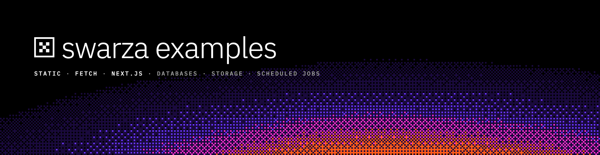

# swarza examples



Apps you can copy and deploy to [swarza](https://stg.swarza.com), from a single HTML page to a news
site with a database, file storage and scheduled jobs. Each folder is a complete project with a
README that walks through the setup.

## Examples

| Example                                  | What it shows                                                                                                                                                               |
| ---------------------------------------- | --------------------------------------------------------------------------------------------------------------------------------------------------------------------------- |
| [starters/static](starters/static)       | A static site: redirects, response headers and a custom 404 in `swarza.json`                                                                                                |
| [starters/fetch-api](starters/fetch-api) | A café site from one `fetch` handler: HTML pages, a JSON API, a form, environment variables and a scheduled job                                                             |
| [nextjs/features](nextjs/features)       | A conference site in Next.js 16: ISR schedule, talk pages, a live page with streaming, Server Actions, images, an attendee wall in a database and photo uploads to a bucket |
| [nextjs/news](nextjs/news)               | A news site with an admin: database, public bucket for images, scheduled publishing, previews                                                                               |

## Use an example

Copy one folder with [degit](https://github.com/Rich-Harris/degit), then follow its README:

```bash
npx degit swarza/examples/nextjs/features my-app
cd my-app
```

Every example deploys with the `swarza` CLI:

```bash
npm i -g https://stg.swarza.com/cli/swarza-cli.tgz
swarza login
swarza deploy --prod
```

The first deploy asks for an application name and creates it. Names are unique across all of
swarza, so add something of your own, such as `news-yourname`. New accounts start with a 14-day
trial that needs no card.

## Documentation

The full guide, including databases, buckets, scheduled jobs, logs and custom domains, is at
[stg.swarza.com/docs](https://stg.swarza.com/docs).
